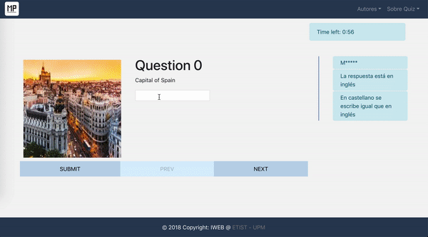

# IWEB - Project 6
## Authors 
Pablo Caraballo Llorente 
Mario Penavades Suárez 

## Built With
- [React JS](https://reactjs.org/)
- [Redux](https://redux.js.org/)

## Commands available
* `npm start` - Starts the development server in developer mode

## Statement
The objective of this practice is to make a set of questions using the technologies seen in class. For this, a Single Page Application will be developed that allows to play the game created just like in the previous practice.

The game will consist of answering 10 random questions from the Quiz game. For this, it is necessary to download the questions and their responses from a web server. The different questions will be shown successively to the user, who will be able to answer each one of them. When finished, the user will press the "Submit" button to evaluate their answers and obtain their percentage of correct answers. The evaluation of the answers will be done in the web application itself, not on the server.

The application must work for the Android and iOS platforms (components or specific functionalities of a platform are not used). Styles will be defined for the components (through the attribute * style *) and the positioning of them using * Flexbox *.

## Requirements
Correct operation of the practice with [React](https://reactjs.org) and [Redux](https://es.redux.js.org) with the following requirements:
* Download the server questions.
* Display the questions in the web interface one at a time.
* Show the image associated with the question if you have it.
* List the tips available for each question if you have them.
* Change question by clicking on the next / back buttons.
* Allow the user to answer the questions.
* Allow the user to evaluate their answers and calculate their score.
* Develop the logic of changing the question and evaluate the answersusing [Redux](https://es.redux.js.org).
* Package the resulting application for production using theinstructions provided.

## Upgrades
* Customization of styles (CSS, animations, original design, spinner, etc.)
* Reset button that asks for a new set of questions to the server and restart the game.
* Countdown that limits the time the user has to answer the ask questions and finish the game if time runs out.

## Demo

    

